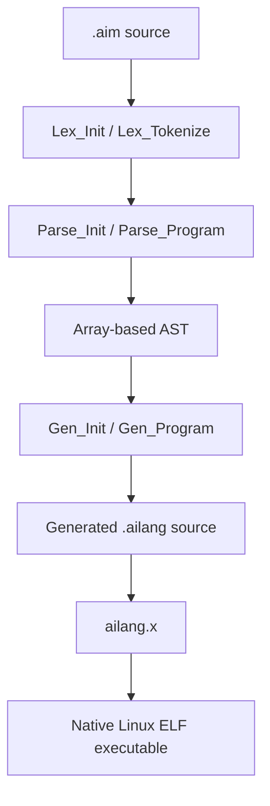

# AIMacro Architecture

**Repository:** `AiLang-Author/AIMacro-Language`  
**Status at this revision:** brace-based AOT implementation; VM is design work, not implemented  
**Evidence:** source tree and recorded scorecards at commit `ed23bdf76e130bc070c20bdeb57090b7c1eda944`

This document describes the architecture that exists in the repository. It intentionally distinguishes implemented behavior from the proposed VM design.

## 1. Current architecture

AIMacro is a Python-like source language using `{ }` blocks. Indentation is not part of the grammar, and the older `end`-terminated syntax belongs to the archived `archive/end-syntax-2025` branch.



The end-to-end path is:

```text
.aim → aimacro.x → .ailang → ailang.x → native ELF
```

The repository contains the transpiler source, but `aimacro.x` and `ailang.x` are build artifacts/toolchain inputs rather than stages implemented by the AIMacro parser itself.

### Implemented versus planned

| Component | Status | Evidence |
|---|---|---|
| Lexer | Implemented | `Librarys/AIMacro/Library.AIMacroCore.ailang`; standalone `Library.AIMacroLexer.ailang` also exists |
| Recursive-descent parser | Implemented | `Library.AIMacroParserCore.ailang`, with OOP extensions |
| Array-based AST | Implemented | `AST_Create`, `AST_GetField`, `FixedPool.Node` |
| AILang source generator | Implemented | `Library.AIMacroCodeGen1` through `4`, OOP, and Dict modules |
| AIMacro runtime builtins | Implemented | `Library.AIMacro.ailang`, `AIMacroString`, `AIMacroDict`, `AIMacroTypes` |
| Native AOT execution | Implemented | `aimacro.x` followed by `ailang.x` |
| Bytecode compiler | Not started | No `AIMacroCompiler` module exists in the tree |
| AIMacro VM | Not started | No `AIMacroVM` module exists in the tree |
| AOT/VM dual mode | Not started | Listed as a future objective only |

## 2. CLI pipeline

The root CLI source is `aimacro_cli.ailang`. Its compile path is:

```text
CLI_Open
  → read the source file
  → Lex_Init
  → Lex_Tokenize
  → Parse_Init
  → Parse_Program
  → Gen_Init
  → Gen_Program
  → Gen_GetOutput
  → write stdout or the requested output file
```

`CLI_CompileFile` owns the source buffer and releases lexer/generator state after generation. The CLI redirects stdout to stderr while compiling so lexer, parser, and code-generation diagnostics do not contaminate generated AILang output. The generated text is written to stdout when no output path is supplied, or to the optional second argument.

Usage:

```bash
./aimacro.x input.aim [output.ailang]
./AIMacro/scripts/run_pipeline.sh AIMacro_Tests/test_harness.aim
```

`run_pipeline.sh` optionally invokes `ailang.x` to compile and run the generated source. `run_matrix.sh` performs the complete transpile → compile → run sequence for every `AIMacro_Tests/*.aim`, piping a sibling `.stdin` fixture when present.

`aimacro_console.ailang` uses the same lexer/parser/code-generator stages for interactive, multiline, and file-compile modes. It is not yet a VM REPL.

## 3. Stage contracts

### 3.1 Lexer

The active lexer state is defined in `Library.AIMacroCore.ailang` as `FixedPool.Lex`. It stores:

- source address and length;
- current byte position, line, and column;
- token type and value arrays;
- token source-line and source-column arrays;
- parenthesis and bracket depth.

`Lex_Tokenize` emits `Token` values from `FixedPool.Token`. The current token model includes identifiers, numbers, strings, floats, f-strings, keywords, operators, delimiters, newlines, and EOF. Newlines inside parentheses or brackets are suppressed to provide Python-like continued expressions.

The lexer supports, among other constructs represented in the token pool:

- functions, classes, control flow, exceptions, imports, `with`, `lambda`, `assert`, `global`, and `nonlocal`;
- integer, hexadecimal, floating-point, and scientific literals;
- arithmetic, comparison, assignment, augmented-assignment, bitwise, shift, power, walrus, and arrow operators;
- comments and escaped strings.

Token values are stored separately from token types. Allocated string and identifier values are released by `Lex_Free` before the token arrays are destroyed.

`Library.AIMacroLexer.ailang` is an older/alternate lexer implementation with a different `Lexer_*` state namespace. The active CLI imports `AIMacroCore`, whose `Lex_*` functions are the implementation used by the current pipeline. This distinction should be preserved until the standalone lexer is either adopted or retired.

### 3.2 Parser and AST

`Library.AIMacroParserCore.ailang` implements a recursive-descent parser. `Parse` stores the token cursor, token count, error flag, error location, and error message. Parsing initializes type-annotation state and produces an array-based AST.

Every AST node has the basic shape:

```text
[type, source_line, source_column, field_0, field_1, ...]
```

The node type constants are in `FixedPool.Node` in `Library.AIMacroCore.ailang`. Current node families include:

- program, function, assignment, return, expression, and augmented assignment;
- `if`, `while`, `for`, tuple unpacking, `break`, `continue`, and `pass`;
- binary/unary expressions, calls, indirect calls, method calls, attributes, indexing, and slices;
- list/dict literals, comprehensions, chained comparisons, ternaries, lambdas, keyword arguments, and named expressions;
- `try`, `except`, `raise`, `with`, and `assert`;
- classes, methods, `super`, imports, and `from ... import ...`.

`AST_GetField` provides the field contract used by code generation. Important layouts include:

| Node | Layout after source location |
|---|---|
| `PROGRAM` | declarations/body |
| `FUNCTION` | name, params, body, return type, defaults, varargs, decorators |
| `CLASS_DEF` | name, bases, body, decorators |
| `METHOD_DEF` | name, params, return type, body, decorators |
| `BINARY_OP` | left, token operator, right |
| `CALL` | function name, argument array |
| `METHOD_CALL` | object, method name, argument array |
| `INDEX_ACCESS` | object/expression, index |
| `TRY_STMT` | try body, except clauses, finally body |
| `LIST_COMP` | expression, iteration variables, iterable, condition |

Parser failures set `Parse.err` and record line and column. Diagnostics are printed by the current implementation through AILang diagnostic primitives; the CLI returns a compilation failure when parsing does not succeed.

### 3.3 Code generation

The generator emits AILang source text rather than bytecode. `FixedPool.Gen` holds the output fragments and code-generation metadata, including:

- indentation and temporary-name counters;
- current parameters and known function signatures;
- string, list, dict, and callable variable sets;
- packed-argument function metadata;
- deferred functions/statements;
- loop and exception nesting;
- generated lambda names.

The generator is split by responsibility:

| Module | Current responsibility |
|---|---|
| `CodeGen1` | generator state, output assembly, function metadata, identifiers, operators |
| `CodeGen2` | program statements and control-flow emission |
| `CodeGen3` | expressions, strings, flattening, and control-flow-sensitive expressions |
| `CodeGen4` | calls, builtin mapping, methods, stdlib shims, keyword arguments |
| `CodeGenOOP` | classes, methods, attributes, instances, `super`, and OOP dispatch |
| `CodeGenDict` | dictionary literals, subscripting, dictionary tracking, and dispatch |

Generated functions use AILang `Function.*` definitions with explicit inputs, outputs, and bodies. Top-level script statements are wrapped in the generated main/subroutine contract. Calls with more than six parameters use a packed argument array; user lambdas are hoisted to generated functions and invoked indirectly.

Several transformations are deliberately semantic rather than textual:

- string concatenation and equality use string-aware runtime operations;
- list, dict, and string operations are selected using generator tracking and type annotations;
- `and`, `or`, ternary expressions, and chained comparisons preserve short-circuit behavior where supported;
- exceptions are lowered to the AILang mechanisms used by the runtime rather than relying on an AILang native unwind model;
- stdlib-shaped imports such as `os`, `json`, `math`, `time`, and `sys` are recognized by code-generation shims.

The generator emits imports for the runtime modules required by the generated program. It is not a general Python module loader.

## 4. Runtime and semantic lowering

Generated AIMacro code calls the AIMacro runtime for Python-like behavior instead of emitting only raw AILang primitives.

| Semantic area | Current implementation |
|---|---|
| Lists and generic containers | `SmartLen`, `SmartGet`, `SmartPush`, typed helpers, and `Array` |
| Strings | `Library.AIMacroString.ailang` and string-aware codegen |
| Dictionaries | `Library.AIMacroDict.ailang`, `Hash`/`SHash`, and `CodeGenDict` |
| Types and truthiness | `Library.AIMacroTypes.ailang`, boxed booleans, `None`, `isinstance`, `type` |
| Numbers | integer helpers, float parsing/operations, power, true division, floor division |
| Exceptions | runtime exception objects and codegen lowering for `try`/`except`/`finally`/`raise` |
| I/O and files | `AIMacro.Print`, `Input`, `Open`, standard handles, and OS syscalls where supported |
| Python-shaped modules | codegen shims for selected `os`, `json`, `math`, `time`, and `sys` operations |
| CLI | command-line arguments and exit handling through AIMacro/OS helpers |

The runtime is partial by design. A passing regression test demonstrates support for the tested construct; it does not imply complete CPython compatibility.

## 5. AOT behavior and test evidence

The following results are recorded in `AIMacro/STATUS.md` and `AIMacro/CONFORMANCE.md` for the 2026-09-19 audit. They are repository-local scorecard results, not an assertion that this document ran the tests during generation.

| Test area | Result | Meaning |
|---|---:|---|
| `AIMacro_Tests/*.aim` | **62/62 transpile, 62/62 compile, 62/62 run** | Full checked-in AOT matrix passed, including stdin fixtures |
| Curated Python compatibility suite | **25/25** | Selected `.py` programs matched the CPython runner |
| Python 3.13 library corpus, transpile stage | **226/531** | 226 files transpiled; 305 failed; this is coverage, not an execution pass rate |
| Class-body parse bucket | **97 files remaining** | Class-body-related parser failures remained after the recorded grind |
| Segmentation faults | **0** | No SIGSEGV in the recorded corpus run |
| Fizzbuzz artifact | **211054 bytes** | Recorded native output artifact size |

The recorded audit also notes fixes for comprehensions, star-unpacking on the left-hand side, string prefixes, exception tuples/dotted exception names, `try`/`except`/`else`, and multi-target `for` unpacking. Remaining documented compatibility gaps include decorators, `**kwargs`, `assert`, `dict()`, and broader class-body coverage.

Re-run the repository checks with:

```bash
# Full AIMacro AOT matrix
./AIMacro/scripts/run_matrix.sh

# One complete pipeline
./AIMacro/scripts/run_pipeline.sh AIMacro_Tests/fizzbuzz.aim

# Curated CPython comparison
python3 tools/aimacro_cpython_runner.py --verbose --timeout 8

# Recorded library transpile corpus command
python3 tools/aimacro_cpython_runner.py --corpus lib --stage transpile --timeout 2 \
  --output-json results/aimacro_conformance.json
```

The matrix script fails if any test fails at transpile, compile, or run. Tests with a same-name `.stdin` file receive that fixture on standard input.

## 6. Repository module map

```text
aimacro_cli.ailang                         CLI transpiler source
aimacro_console.ailang                     interactive console
Librarys/AIMacro/Library.AIMacroCore       token/node/state definitions
Librarys/AIMacro/Library.AIMacroLexer      alternate/older lexer implementation
Librarys/AIMacro/Library.AIMacroParser*   parser and OOP extensions
Librarys/AIMacro/Library.AIMacroCodeGen*  AILang source generation
Librarys/AIMacro/Library.AIMacro*.ailang  runtime, strings, dicts, types
Librarys/AIMacro/Library.PAST*.ailang     alternate/experimental PAST code
AIMacro_Tests/                              checked-in AIMacro AOT tests
tests/python/curated/                      CPython comparison programs
tools/                                      Python conversion and test runners
AIMacro/scripts/                            pipeline, matrix, and audit scripts
```

`Librarys` is the actual directory name in this repository; it is retained here even though “Libraries” might be clearer in a future rename.

## 7. Core AILang dependencies

The generated program and AIMacro runtime use core AILang facilities including:

| AILang facility | Current use |
|---|---|
| `Array` / `Arrays` | token storage, AST fields, lists, output fragments, packed arguments |
| `Hash` / `SHash` | dictionary storage and membership/order behavior |
| `StringUtils` and string primitives | comparison, concatenation, conversion, escaping |
| `FixedPointTrig` and numeric primitives | math and numeric operations |
| syscall primitives | CLI file access, standard I/O, process exit, selected stdlib shims |

A generated program links the libraries referenced by its generated `LibraryImport` lines; it does not require the complete display/OS stack of AILang.

## 8. Planned VM architecture

No VM compiler, runtime, opcode definition, or dispatch loop exists in the current tree. The VM is a future conversion of the existing frontend and semantics, intended for a faster REPL and future embedding.

The proposed direction is:

```text
AIMacro lexer/parser → AIMacroCompiler → bytecode + constant pool
                                      → AIMacroRuntime values
                                      → AIMacroVM stack/frames/dispatch
```

Proposed modules, all currently absent:

| Module | Proposed role |
|---|---|
| `Library.AIMacroCompiler` | lower the existing AST to bytecode |
| `Library.AIMacroRuntime` | represent integers, floats, strings, lists, dicts, objects, and exceptions |
| `Library.AIMacroVM` | operand stack, call frames, globals, and execution state |
| `Library.AIMacroVM.Builtins` | builtin dispatch to AIMacro runtime operations |
| `Library.AIMacroVM.Dispatch` | opcode dispatch loop |

The VM should not be treated as behaviorally complete until it passes the same `AIMacro_Tests` matrix as AOT. The first implementation should also add AOT-versus-VM equivalence tests for output, exit status, exceptions, ordering, and stdin behavior.

Open design decisions include value representation, memory ownership/garbage collection, closure support, exception unwinding, bytecode versioning, and whether the AOT and VM paths share one runtime semantic layer.

## 9. Maintenance rules

When changing the implementation:

1. Update token/node or AST layout documentation when a field changes.
2. Add or update an `AIMacro_Tests/*.aim` regression test for language behavior.
3. Run `run_matrix.sh` before claiming AOT compatibility.
4. Update `STATUS.md` and `CONFORMANCE.md` with the measured commit/date and counts.
5. Keep proposed VM components marked as planned until corresponding source files and tests exist.

Related documents:

- [SPECIFICATION.md](SPECIFICATION.md) — language contract
- [STATUS.md](STATUS.md) — current build and test scorecard
- [TEST_MATRIX.md](TEST_MATRIX.md) — AOT test inventory and tiers
- [CONFORMANCE.md](CONFORMANCE.md) — CPython compatibility measurements
- [PYTHON_GAP.md](PYTHON_GAP.md) — known compatibility gaps
